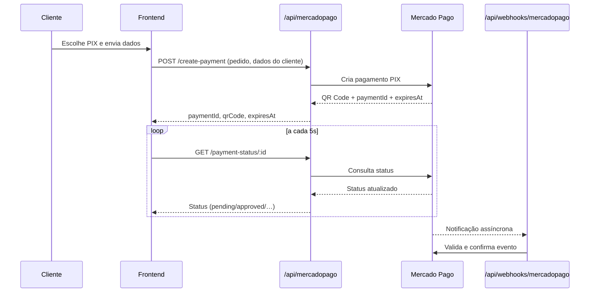

# 💳 Integração de Pagamentos - VZ Dolci

## Visão Geral
O checkout utiliza **Mercado Pago** para pagamentos via **PIX**. O frontend (React + Vite) chama funções serverless na Vercel que criam o pagamento, retornam QR Code, consultam status e registram webhooks.

## Fluxo


## Variáveis de Ambiente
- `VITE_MP_PUBLIC_KEY` (frontend) – disponível em todos os ambientes.
- `MP_ACCESS_TOKEN` (backend) – **apenas produção**.
- `MP_REFUND_API_KEY` (backend) – **apenas produção**.

## Endpoints
- `POST /api/mercadopago/create-payment` – cria pagamento PIX, aplica rate limiting (5 req/min por IP) e retorna `paymentId`, `qrCode`, `expiresAt`.
- `GET /api/mercadopago/payment-status/:id` – consulta status atual.
- `POST /api/mercadopago/refund` – estorno protegido por `x-api-key` (`MP_REFUND_API_KEY`).
- Webhook: `POST /api/webhooks/mercadopago` – recebe notificações oficiais.

### Exemplo (create-payment)
```bash
curl -X POST https://<host>/api/mercadopago/create-payment \
  -H "Content-Type: application/json" \
  -d '{
    "order": { "id": "ORDER-123", "total": 55, "customerInfo": { "email": "test@test.com", "cpf": "12345678909" } },
    "paymentData": { "method": "pix", "amount": 55 }
  }'
```

## Segurança e Observabilidade
- **Rate limiting**: 5 requisições/minuto com header `Retry-After: 60` em caso de bloqueio.
- **Estorno protegido**: exige `x-api-key` (`MP_REFUND_API_KEY`).
- **Logs estruturados**: `api/utils/logger.js` emite JSON para facilitar leitura nos logs da Vercel.
- **Frontend**: mostra estados de carregamento, polling automático e timer de expiração do QR Code.

## Troubleshooting
- **429 Muitas tentativas**: aguarde 60s e tente novamente (frontend exibe botão de fallback para WhatsApp).
- **QR Code expirado**: contador chega a 00:00 → gere novo QR Code.
- **Sem chave pública**: certifique-se de preencher `VITE_MP_PUBLIC_KEY` no ambiente da Vercel e no `.env` local (apenas teste).
- **Webhook não dispara**: verifique URL pública configurada no app do Mercado Pago e credenciais de produção.
